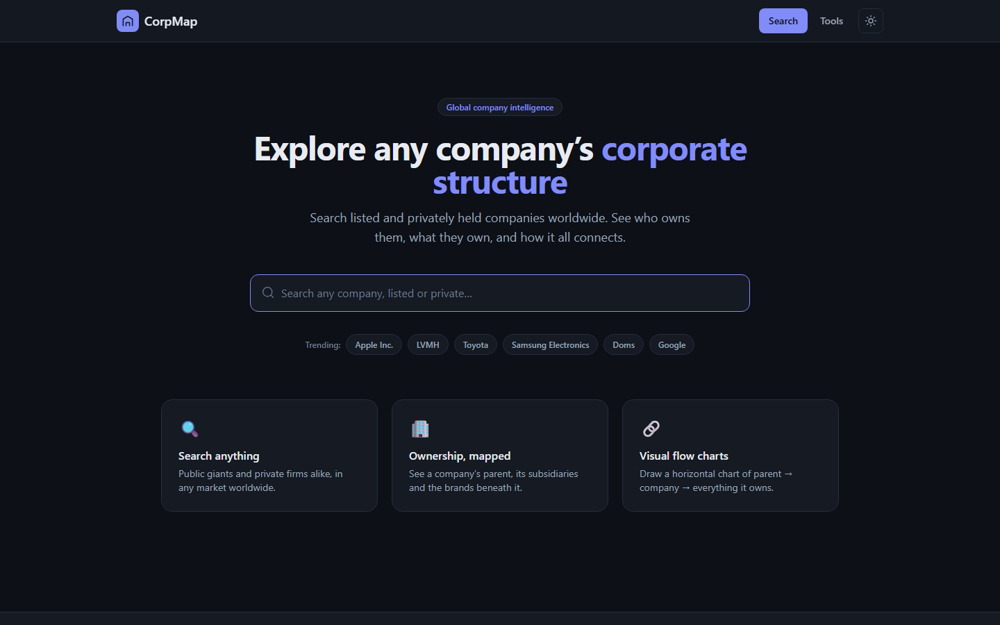
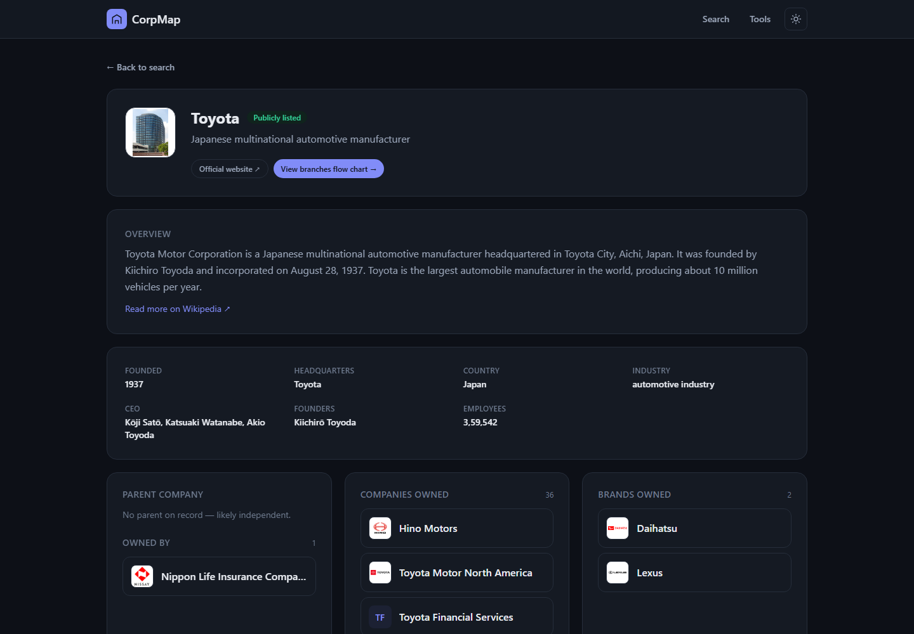
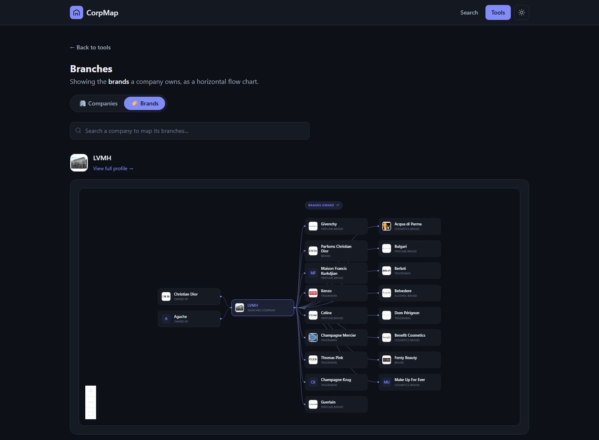

<div align="center">

# CorpMap

**Explore who owns whom, for listed and private companies worldwide.**

Search any company, see its parent, the companies and brands it owns, and draw its corporate structure as an interactive flow chart.

[](https://github.com/yusufmj2005/Corp-Map/actions/workflows/ci.yml)
[](https://github.com/yusufmj2005/Corp-Map/releases)
[](LICENSE)



</div>

## Features

- **Global company search.** Covers listed and non-listed companies from any country, using Wikidata and Wikipedia.
- **Company profiles.** Each profile has an overview, key facts (founded, HQ, CEO, founders, employees), stock tickers, parent company, shareholders, companies owned and brands owned.
- **Branches tool.** Draws a horizontal flow chart from parent company to the company, then to the companies or brands it owns. Every node is clickable, so you can walk the ownership tree.
- **Corporate structure chart.** Every company page has one, with owned companies and owned brands grouped separately.
- **AI research fallback.** When Wikidata has no ownership data (common for regional brands such as Doms or Apsara), a small backend asks Claude to research the company with web search. Results are clearly labelled as unverified.
- **Light and dark mode.** Follows your system setting, with a manual toggle.

## Screenshots

| Company profile | Branches flow chart |
| --- | --- |
|  |  |

## Tech stack

| Layer | Tools |
| --- | --- |
| Frontend | React 19, TypeScript, Vite, Tailwind CSS v4, React Router, React Flow |
| Backend | Express 5, Anthropic SDK (structured output and web search), Zod |
| Data | Wikidata (search API, entity API, SPARQL) and the Wikipedia REST API |
| Tooling | oxlint, tsx, concurrently, GitHub Actions |

## Getting started

### Prerequisites

- Node.js 20 or newer
- An [Anthropic API key](https://console.anthropic.com/settings/keys). Optional: it's only needed for the AI research fallback.

### Install and run

```bash
git clone https://github.com/yusufmj2005/Corp-Map.git
cd Corp-Map
npm install
cp .env.example .env   # then add your ANTHROPIC_API_KEY (optional)
npm run dev
```

`npm run dev` starts both servers:

| Service | URL |
| --- | --- |
| Website (Vite) | http://localhost:5173 |
| AI API (Express) | http://localhost:8787 (Vite proxies `/api` to it) |

Search, profiles and charts work without an API key. Only the AI research panel needs one.

### Environment variables

| Variable | Required | Default | Description |
| --- | --- | --- | --- |
| `ANTHROPIC_API_KEY` | For AI research | — | Server-side only. Never sent to the browser. |
| `API_PORT` | No | `8787` | Port for the Express API |
| `CORPMAP_MODEL` | No | `claude-opus-5` | Claude model used for AI research |

## Scripts

| Command | What it does |
| --- | --- |
| `npm run dev` | Run the website and API together with hot reload |
| `npm run dev:web` | Run only the Vite dev server |
| `npm run dev:api` | Run only the API server (watch mode) |
| `npm run build` | Type-check and build the production site into `dist/` |
| `npm run typecheck` | Type-check without building |
| `npm run lint` | Lint with oxlint |
| `npm start` | Serve the built site and the API from one Express server |

## How it works

```
Browser ──► Wikidata / Wikipedia APIs       (search, entities, SPARQL, summaries)
   │
   └──► /api/enrich ──► Express ──► Claude + web search   (only when Wikidata has no ownership data)
```

1. **Search** queries Wikidata entity search and Wikipedia article search in parallel, then merges and ranks the results to favour companies.
2. **Profiles** load the Wikidata entity and resolve related organisations in a single SPARQL query, falling back to the entity API if SPARQL fails:
   - parent organisation (`P749`)
   - owned by (`P127`)
   - subsidiaries (`P355`)
   - business divisions (`P199`)
   - owner of (`P1830`)
3. **Brands vs companies** are separated by each item's Wikidata type (brand, trademark or marque).
4. **AI research** runs only when a company has no recorded subsidiaries. The server grounds Claude in the company's Wikipedia article, lets it search the web, and returns structured JSON validated with Zod.

## Project structure

```
├── server/              Express API (AI research endpoint, serves dist/ in production)
├── src/
│   ├── components/      UI components (flow chart, search bar, lists, navbar)
│   ├── lib/             Wikidata client, AI client, theme, shared types
│   └── pages/           Home, company profile, tools, Branches tool
├── public/              Static assets
├── docs/screenshots/    Images used in this README
└── logos/               Logo design concepts and iterations
```

## Data and limitations

- Company data comes from [Wikidata](https://www.wikidata.org) and [Wikipedia](https://www.wikipedia.org) under CC BY-SA. Coverage and accuracy depend on those sources.
- Ownership is only shown where it's recorded on the company's own Wikidata item. Items that name a company as their parent, but aren't listed on that company, won't appear.
- AI research results aren't from Wikidata and may be wrong. Treat them as leads, not facts.

## Contributing

Contributions are welcome. See [CONTRIBUTING.md](CONTRIBUTING.md) for setup and guidelines, and [SECURITY.md](SECURITY.md) to report a vulnerability.

## License

[MIT](LICENSE) © 2026 Yusuf
